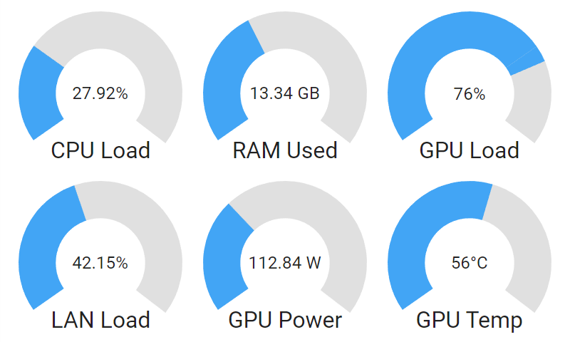
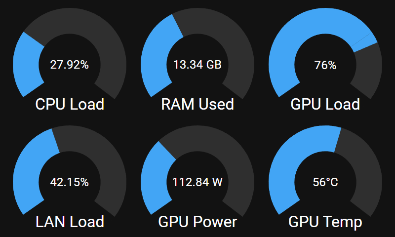
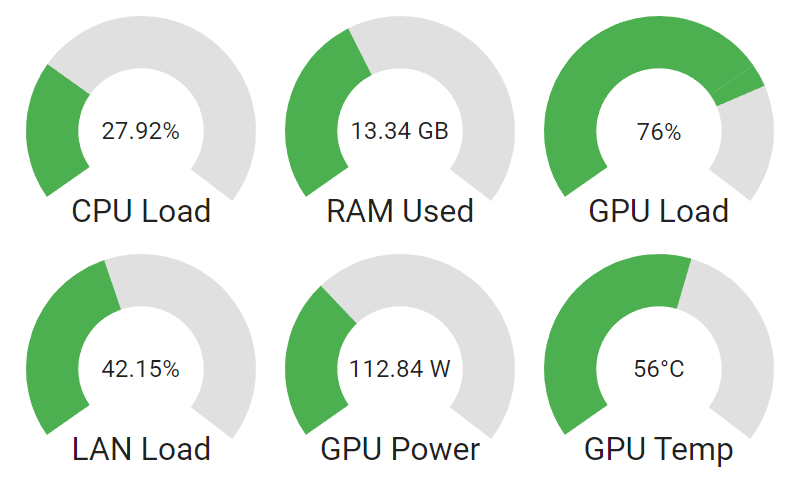
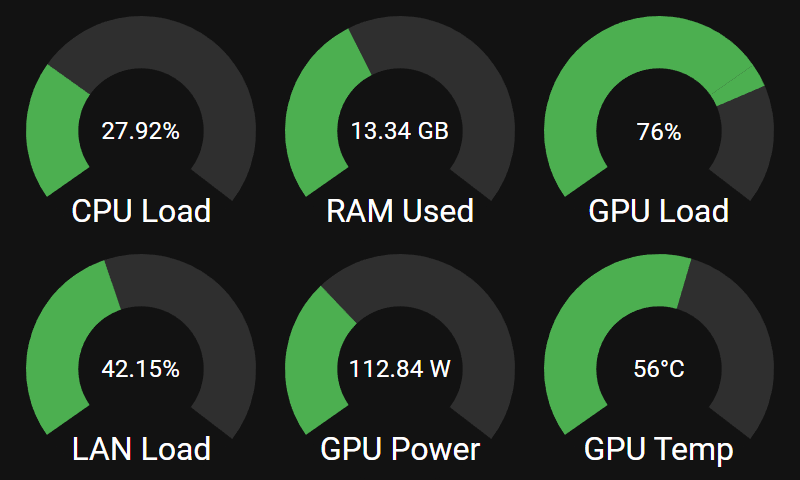

   
   <h1 align="center">Minimon</h1>

 

 

---

Minimon is a lightweight system monitoring application that allows you to monitor your system vitals in real time on any device connected to your local network.

The core idea behind Minimon is that you can breathe new life into any old cellphones, tablets, laptops, etc and use them for something other than taking up space in a land fill. Simply start the server on the computer whose system vitals you wish to monitor, and navigate to that devices IP address on any device on your local network. That's it!

## Screenshots

   
   
    
   
   

## System Requirements

Not enough testing has been done to properly determine the minimum system requirements to run Minimon. Generally speaking, the server should be able to run on any piece of hardware made within the last 10 years without issue. The client has been verified working on hardware as low end as a Raspberry Pi 3 Model B.

Feel free to give Minimnon a shot and let me know how it runs!

## Getting Started

To get started with Minimon, please refer the the Wiki. Some useful pages have been listed below:

- Installation: https://github.com/KasimAhmic/minimon/wiki#installation
- Customization: https://github.com/KasimAhmic/minimon/wiki#customization
- Device Configuration: https://github.com/KasimAhmic/minimon/wiki/Device-Configuration
- Contributing: https://github.com/KasimAhmic/minimon/wiki/Contributing
